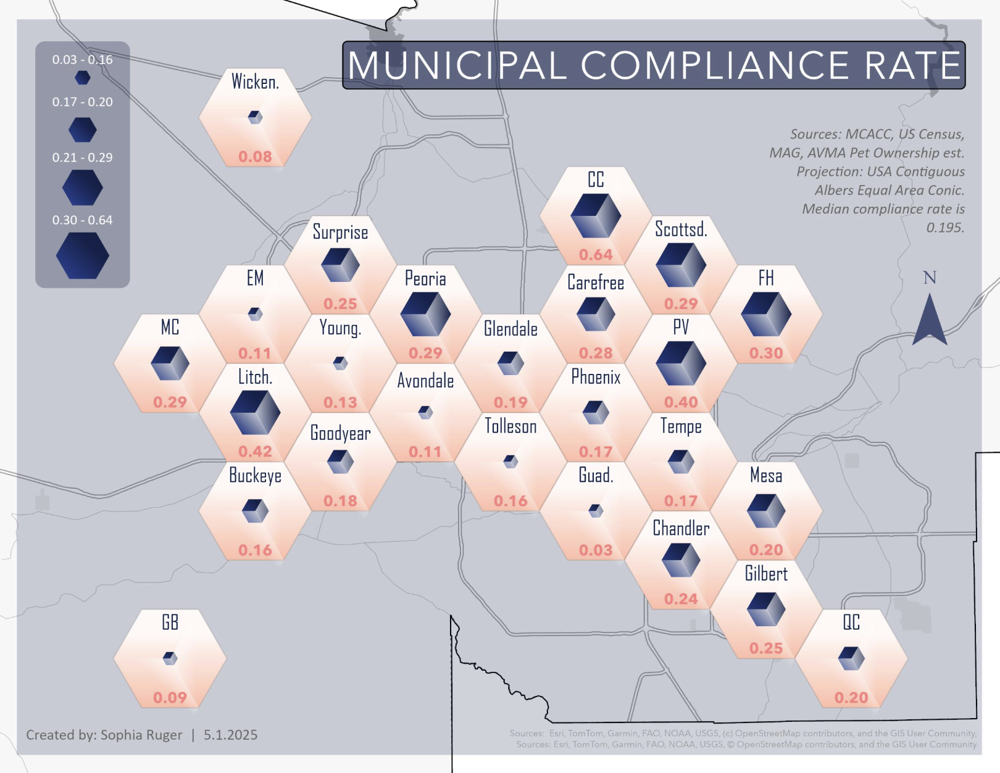
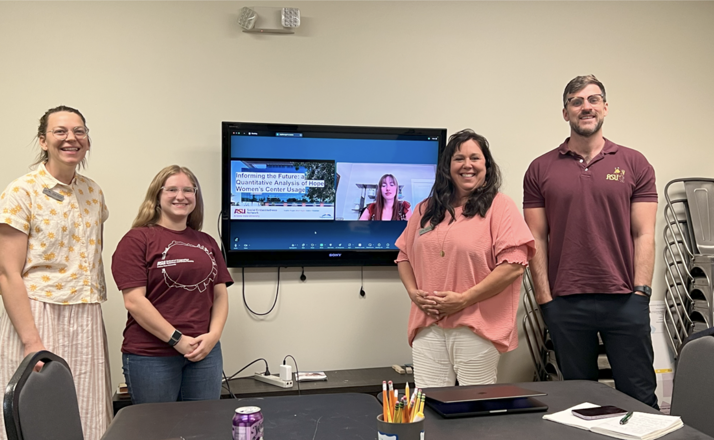

<!-- ABOUT SECTION -->
<section id="about">
  <h2 class="section-title">About</h2>

<!--
  

    

      <h3>Who I Am</h3>
      
I'm a geospatial data analyst and environmentalist with a passion for using cartography as an art and science to solve challenges. I combine my creativity, technical skills and complex-adaptive thinking to tell stories through spatial data. In my free time I enjoy hiking, bouldering, sewing, and other creative endeavors! 

    

    

      <h3>What I Do</h3>
      
From spatial analysis and cartographic design to environmental and social impact assessments, I build spatial solutions that help organizations make better decisions. I have experience in coding (Python, R, SQL), data reporting, 2D and 3D catrographic visualization (ArcGIS Online(AGOL), Leaflet), statstical analysis, science communication, and leadership.

    

    

      <h3>My Approach</h3>
      
Every project I undertake is driven by a commitment to accuracy, clarity, and a deep respect for the social, cultural, or environmental landscapes I am mapping. Above all, I am searching for clients with guiding values similar to my own: the use of technology as a force for good.

    

  
 
  -->

  

    

      <h3>Who I Am</h3>
      
I'm a geospatial data analyst and environmentalist with a passion for using cartography as an art and science to solve challenges. I combine my creativity, technical skills and complex-adaptive thinking to tell stories through spatial data. In my free time I enjoy hiking, bouldering, sewing, and other creative endeavors!

    

    

      <h3>What I Do</h3>
      
From spatial analysis and cartographic design to environmental and social impact assessments, I build spatial solutions that help organizations make better decisions. I have experience in coding (Python, R, SQL), data reporting, 2D and 3D cartographic visualization (ArcGIS Online (AGOL), Leaflet), statistical analysis, science communication, and leadership.

    

    

      <h3>My Approach</h3>
      
Every project I undertake is driven by a commitment to accuracy, clarity, and a deep respect for the social, cultural, or environmental landscapes I am mapping. Above all, I am searching for clients with guiding values similar to my own: the use of technology as a force for good.

    

  

  

  
</section>

<!-- PROJECTS SECTION -->
<section id="projects">
  <h2 class="section-title">Professional Projects</h2>

  

    <!-- PROJECT CARD 1
         To edit: change the image source, title, description, and link.
         The onclick passes: title, description, image path, project URL -->
    

      
      

        <h4>Dog Licensing Compliance</h4>
        
Multivariate analysis to better understand pet owner compliance and target interventions.

        AGOL · Hot Spot Analysis
      

    

    <!-- PROJECT CARD 2 -->
    

      
      

        <h4>Watershed Restoration Index</h4>
        
Spatial prioritization model for restoration site selection.

        Hydrology · ArcGIS Pro
      

    

    <!-- PROJECT CARD 3 -->
    

      
      

        <h4>Wildfire Risk Dashboard</h4>
        
Interactive Leaflet.js map of Oregon wildfire risk factors.

        Web Mapping · Leaflet.js
      

    

    <!-- ADD MORE PROJECTS by copying a project-card block above and editing the text/images -->

  

</section>

<!-- CONTACT SECTION -->
<section id="contact">
  <h2 class="section-title">Contact</h2>
  

    Interested in collaborating or have a project in mind? Connect with me below.
  

  

    <a href="mailto:503soph@gmail.com" style="color:#2a7f6f; font-weight:500;">503soph@gmail.com</a>
    &nbsp;·&nbsp;
    <a href="https://www.linkedin.com/in/sophia-ruger-13b313271/" style="color:#2a7f6f; font-weight:500;" target="_blank">LinkedIn</a>
    &nbsp;·&nbsp;
    <a href="https://github.com/sgruger" style="color:#2a7f6f; font-weight:500;" target="_blank">GitHub</a>
  

</section>
